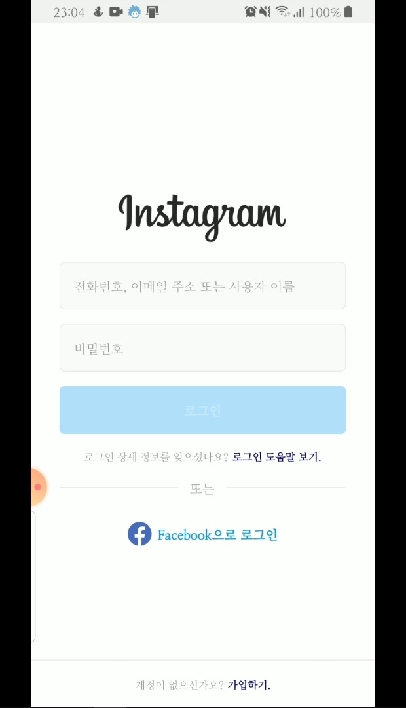

  
  
  

### Overview
* **Duration:** August - September 2020 (3 weeks)
* **Team Size:** 3 developers
* **Role:** Lead Android Developer (100% of frontend implementation)

A comprehensive Android application that replicates the core functionality and user experience of Instagram. This project was my first Android development endeavor after beginning to study the platform in July 2020. Working in collaboration with two backend developers, I successfully delivered a fully functional mobile application that closely mirrors Instagram's interface and features.

### Key Responsibilities & Achievements
* Implemented pixel-perfect UI/UX design matching Instagram's interface
* Established robust client-server communication protocols
* Developed complete user authentication flow
* Built responsive and interactive social features including posts, comments, likes, and bookmarks
* Created efficient data management systems for content delivery

### Core Features
* **User Authentication:** Secure registration and login system
* **Content Management:** Create, edit, and delete posts and comments
* **Social Networking:** User follow/unfollow functionality
* **Interactive Feed:** Dynamic content viewing with like and bookmark capabilities
* **Profile Management:** Customizable user profiles with editing options

### Technical Stack
* **Primary Language:** Java
* **Libraries & Frameworks:** 
  * Glide (image loading and caching)
  * GSON (JSON parsing)
  * Retrofit2 (HTTP client)
* **Development Tools:** Android Studio, Git

### Key Takeaways
This project provided valuable insights into client-server architecture and the importance of effective team communication in software development. Additionally, it enhanced my skills in creating visually appealing and functionally robust mobile applications.

### Demo

  <iframe width="800" height="450" src="https://www.youtube.com/embed/UUYLn0pjgMA" frameborder="0" allow="accelerometer; autoplay; clipboard-write; encrypted-media; gyroscope; picture-in-picture" allowfullscreen></iframe>

