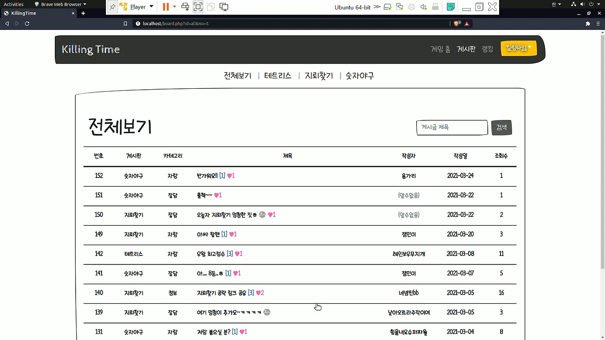

  

  
  

### Overview
* **Duration:** February - March 2021 (5 weeks)
* **Team Size:** Solo project
* **Role:** Product Designer (100%), Web Developer (100%), Server Developer (100%)

A comprehensive web-based gaming platform featuring three classic games: Tetris, Minesweeper, and Bulls and Cows (Number Baseball). The platform includes dedicated forums for each game where users can share strategies and showcase their rankings.

### Development Context
This full-stack project was independently developed to create an engaging platform for enjoying classic games. Through this development process, I gained valuable hands-on experience in both frontend and backend technologies, establishing a strong foundation in web development principles.

The project served as an excellent opportunity to implement server infrastructure from scratch, allowing me to develop practical skills in both client-side and server-side programming.

### Core Features
* **Multiple Game Implementation:** Complete versions of Tetris, Minesweeper, and Bulls and Cows
* **Community Engagement:** Game-specific forums for strategy sharing and discussion
* **Competitive Elements:** Leaderboards and ranking systems for each game
* **User Management:** Registration, authentication, and personalized profile pages

### Technical Stack
* **Frontend:** 
  * HTML, CSS, JavaScript
  * jQuery for DOM manipulation
  * Ajax for asynchronous data handling
  * Bootstrap for responsive design
* **Backend:** 
  * Ubuntu server environment
  * Apache web server
  * PHP for server-side logic
  * PHPMailer for notification functionality
* **Database:** MySQL
* **Development Tools:** Visual Studio Code, Git

### Key Achievements
Successfully designed and implemented a complete gaming ecosystem integrating multiple interactive games with community features, demonstrating comprehensive full-stack development capabilities.

### Demo

  <iframe width="800" height="450" src="https://www.youtube.com/embed/videoseries?list=PLcqydZUPyilvXWHubLj1eEEiBjR9xYFrV" frameborder="0" allow="accelerometer; autoplay; clipboard-write; encrypted-media; gyroscope; picture-in-picture" allowfullscreen></iframe>

