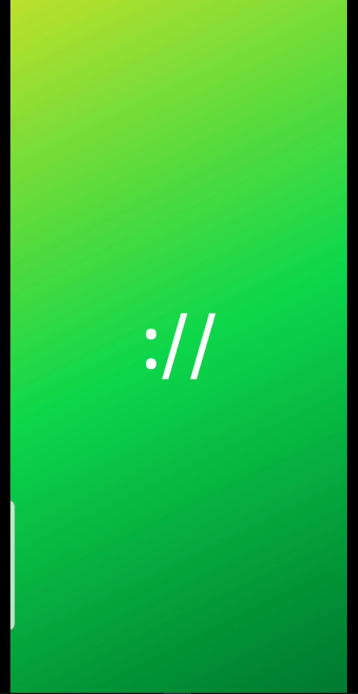
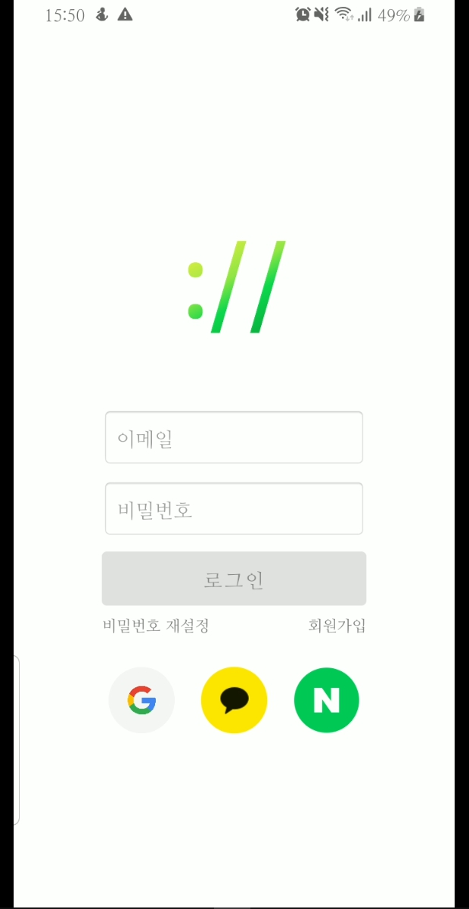
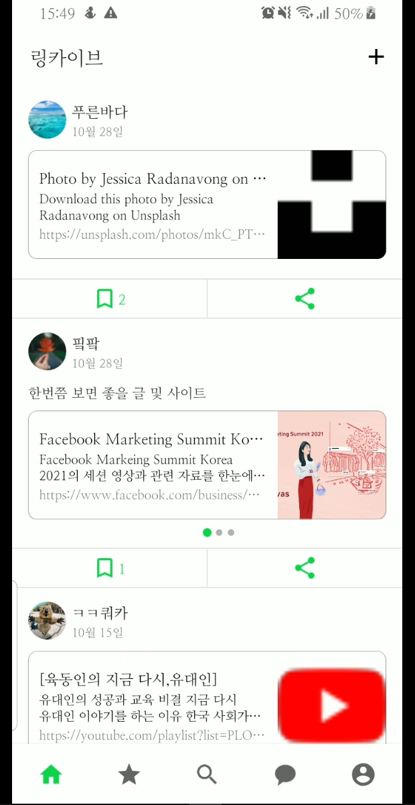
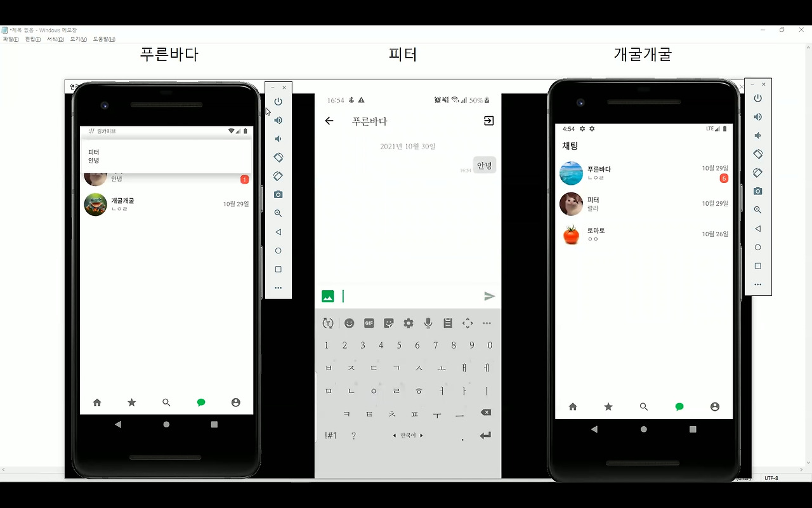

  
  
  

  

### Overview
* **Duration:** October 2021 (5 weeks)
* **Team Size:** Solo project
* **Role:** Product Designer (100%), Android Developer (100%), Server Developer (100%)

A comprehensive social networking service designed for saving and sharing web links in a post format. The platform enables users to bookmark content from other users and engage in direct one-to-one messaging.

### Development Context
This project, my second full-stack development endeavor, was conceived to address the personal frustration of recording links across multiple locations. The application provides a centralized solution for storing, organizing, and sharing valuable web resources.

Through building a custom chat server and implementing it within the Android environment, I significantly deepened my understanding of TCP/IP networking principles and Android-specific components such as Services and Broadcast Receivers.

A distinctive feature of the application is its implementation of OpenGraph metadata extraction, which provides users with rich visual previews of shared links, enhancing content recognition and user experience.

While the final product represents a scaled-down version of my initial vision due to time constraints, it remains a project I'm passionate about continuing to develop and expand.

### Core Features
* **Content Management:** Post creation and sharing functionality
* **Social Engagement:** Subscription and bookmarking systems
* **Direct Communication:** One-to-one chat capability with user search
* **Profile Management:** Personalized user profiles
* **Authentication Options:** Local login and social authentication (Google, Kakao, Naver)

### Technical Stack
* **Android Development:**
  * Kotlin programming language
  * MVP architecture pattern
  * Glide for image handling
  * Retrofit2 for API communication
  * Multiple social login integrations
  * GSON for JSON processing
  * Paging library for content loading

* **API Server:**
  * Ubuntu operating system
  * NGINX web server
  * PHP for backend logic
  * PHPMailer for notifications
  * OpenGraph tag parsing
  * JWT for authentication

* **Chat Server:**
  * Kotlin and Java
  * GSON for data serialization
  * JDBC for database connectivity

* **Database:** MySQL

* **Communication Protocols:**
  * HTTP for API requests
  * TCP/IP for chat functionality
  * SMTP for email services

* **Development Tools:**
  * Android Studio
  * PhpStorm
  * Git version control

* **Deployment:** AWS EC2 cloud infrastructure

### Key Learning Outcomes
Successfully implemented a multi-server architecture combining RESTful API services with real-time communication capabilities, demonstrating comprehensive full-stack development expertise across multiple technologies and protocols.

### Demo

  <iframe width="800" height="450" src="https://www.youtube.com/embed/videoseries?list=PLcqydZUPyiltdIx4iUld_enrtp-Aef-lw" frameborder="0" allow="accelerometer; autoplay; clipboard-write; encrypted-media; gyroscope; picture-in-picture" allowfullscreen></iframe>

