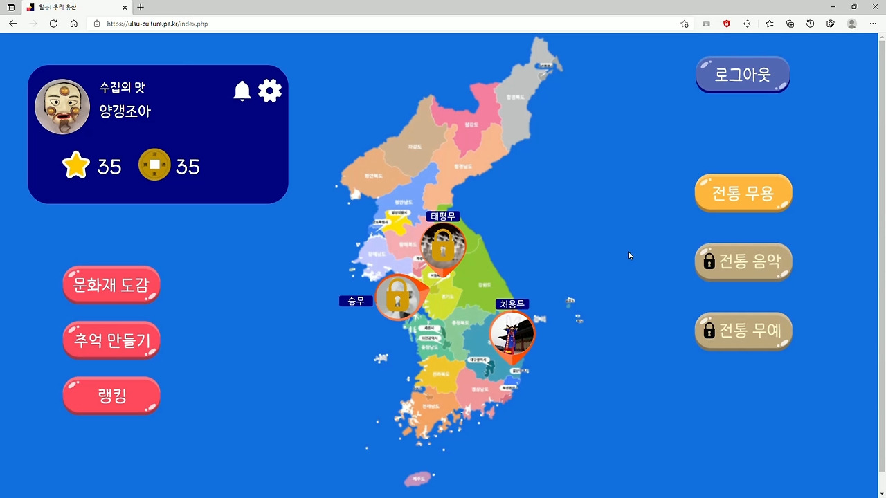
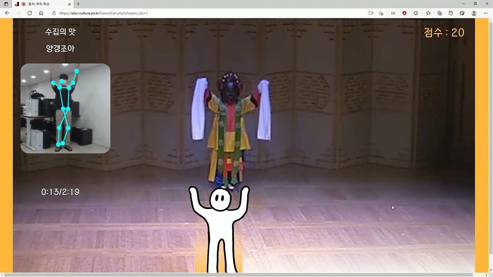
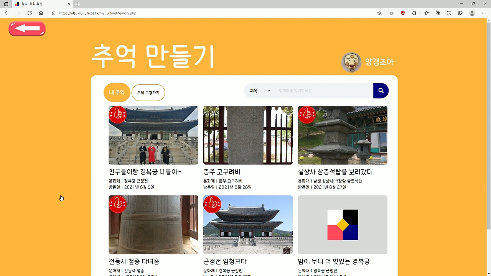

  

  
  

### Overview
* **Total Duration:** July - September 2021 (3 months)
* **Development Period:** July 2021 (3 weeks)
* **Team Size:** 4 members
* **Role:** Team Leader, Product Strategist (50%), Server Developer (100%)

An interactive educational service that combines motion-recognition traditional dance games with cultural heritage storytelling, providing users with an immersive experience of Korean traditional culture. The platform enables users to learn traditional dances through motion detection technology while simultaneously exploring Korean cultural heritage.

### Recognition & Achievements
**Grand Prize Winner (1st Place)** in the "2021 Cultural Heritage Public Big Data Utilization Competition"

Subsequently selected as a finalist in the "9th Pan-Government Public Data Startup Competition," where we presented in the service development category.

### Development Context
This project served as a pivotal stepping stone for my entrepreneurial journey, providing valuable experience in developing business plans and startup fundamentals. As the project team leader, I coordinated a diverse team consisting of one product planner and two frontend developers.

Under significant time constraints, I successfully guided the team through the entire project lifecycle—from conceptualization and planning to development and final presentation—ultimately achieving exceptional results.

### Core Features
* **Motion Recognition Dance Game:** Interactive traditional dance learning through movement detection
* **Cultural Heritage Encyclopedia:** Comprehensive digital collection of cultural artifacts
* **Achievement System:** User engagement through titles and recognition
* **Memory Creation:** Interactive features for personalizing user experiences
* **Administration Portal:** Backend management system for content and user data

### Technical Stack
* **Frontend:** 
  * Google Teachable Machine for motion recognition
  * HTML, CSS, JavaScript
  * cURL for API integration
  * Bootstrap for responsive design
* **Backend:** 
  * Ubuntu server environment
  * Apache web server
  * PHP for server-side processing
  * JWT (JSON Web Tokens) for authentication
* **Database:** MySQL
* **Development Tools:** Visual Studio Code, Git
* **Deployment:** iwinv hosting services

### Key Impact
Successfully transformed cultural heritage data into an engaging interactive experience, demonstrating how technology can preserve and promote traditional culture while creating new educational opportunities.

### Demo

  <iframe width="800" height="450" src="https://www.youtube.com/embed/videoseries?list=PLcqydZUPyiltXlWx9h0UhQmx0DnL0W-DQ" frameborder="0" allow="accelerometer; autoplay; clipboard-write; encrypted-media; gyroscope; picture-in-picture" allowfullscreen></iframe>

