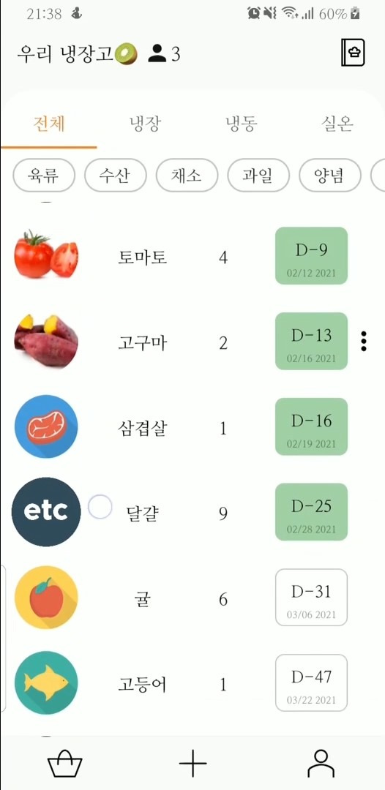
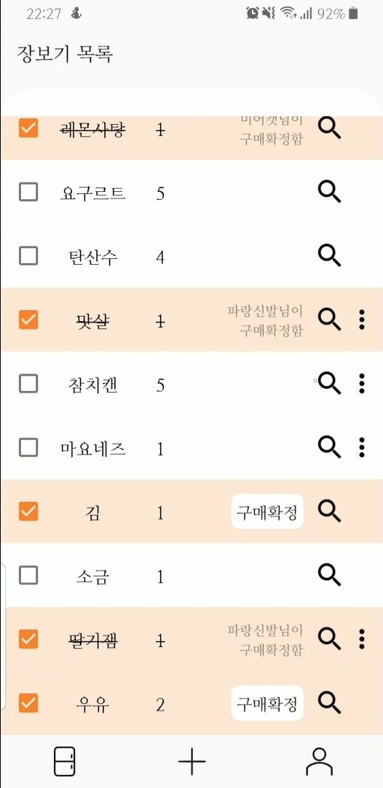

  
  
  

### Overview
* **Duration:** December 2020 - February 2021 (6 weeks)  
* **Team Size:** Solo project  
* **Role:** Product Designer (100%) & Android Developer (100%)

An intuitive mobile application designed to streamline household refrigerator management. This solution enables multiple users to collectively monitor and manage refrigerator contents through a shared digital platform, significantly improving household inventory management.

### Development Context
This was my first solo project encompassing the entire product lifecycle from conceptualization to implementation. Inspired by personal frustrations with home ingredient management, I developed a solution that allows for collaborative refrigerator management without requiring a dedicated server infrastructure.

Throughout the development process, I placed substantial emphasis on thoughtful feature planning and intuitive UI/UX design, constantly considering real-world user scenarios and practical functionality.

### Core Features
* **Social Authentication:** Secure Google login integration
* **Collaborative Management:** Create refrigerators, invite members, and manage shared access
* **Inventory Tracking:** Comprehensive ingredient management with expiration date notifications
* **Recipe Integration:** Search functionality for meal preparation based on available ingredients
* **Shopping List:** Convenient grocery planning tools
* **E-commerce Search:** Direct product search capabilities for shopping needs
* **User Management:** Profile customization and refrigerator member administration

### Technical Stack
* **Primary Language:** Java
* **Libraries & APIs:** 
  * Glide (image handling)
  * GSON (JSON processing)
  * Retrofit2 (network operations)
  * Google Authentication
  * Firebase (backend services)
  * Food Safety Korea OpenAPI (food information)
* **Development Tools:** Android Studio, Git

### Key Achievements
Successfully designed and implemented a serverless solution for collaborative refrigerator management, demonstrating strong capabilities in both product design and technical implementation.

### Demo

  <iframe width="800" height="450" src="https://www.youtube.com/embed/lTjL7DvCdNc" frameborder="0" allow="accelerometer; autoplay; clipboard-write; encrypted-media; gyroscope; picture-in-picture" allowfullscreen></iframe>

